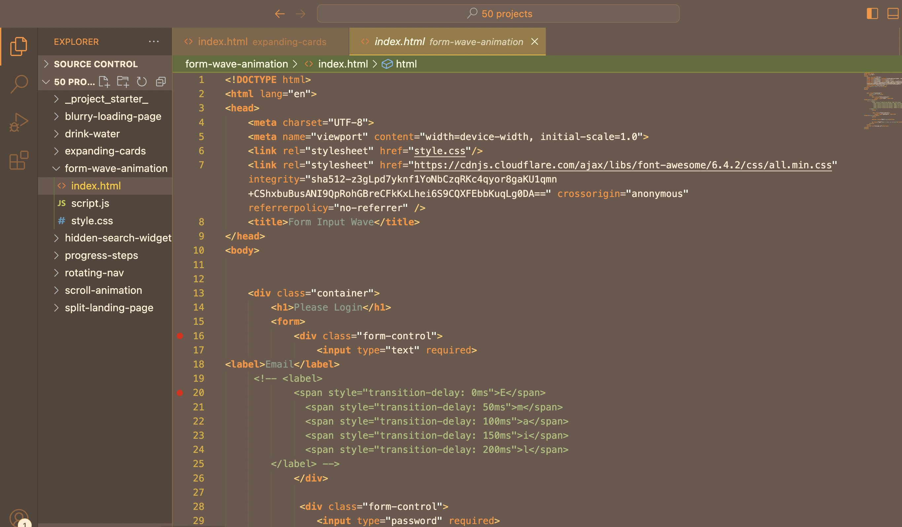

## Cosy Autumn Earthy Vsc Theme created by @KodingWithKhara

## preview 💻

## Installation

1. Open the **Extensions** sidebar in VS Code
2. Search for `KodingWithKhara Theme`
3. Click **Install**
4. Open the **Command Palette** with `Ctrl+Shift+P` or `⇧⌘P`
5. Select **Preferences: Color Theme** and choose a kodingwithkhara---theme.
6. Enjoy!

## Socials:
